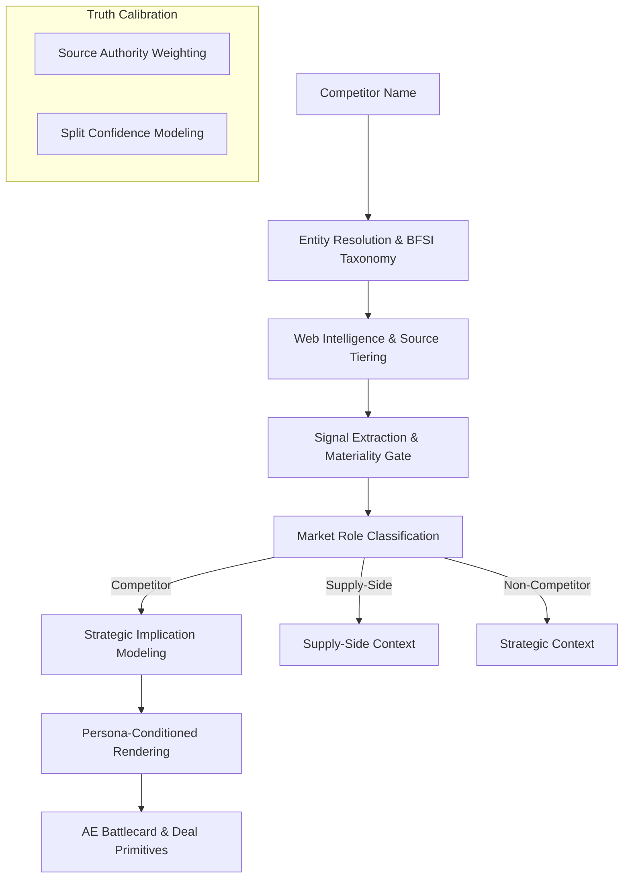

# CounterSignal — GTM Intelligence Engine for BFSI Infrastructure

> "Moving from fact-injection to strategic implication modeling."

## The Pivot: From RAG to Operational Intelligence

CounterSignal is not a "battlecard generator." It is a **Category-Aware GTM Intelligence Infrastructure** designed to deliver field-realistic sales rebuttals and strategic insights for BFSI infrastructure teams.

While standard RAG tools focus on *retrieving facts*, CounterSignal focuses on *modeling implications*. It transforms raw market signals into specific GTM displacement vectors, tailored for the stakeholders who actually make buying decisions.

---

## Core Architecture: The "Palantir" Approach

### 1. Strategic Implication Modeling (SIM)
The engine decouples raw signals from prose using a **Strategic Primitive Layer**. Every signal is processed through an implication graph:
`Signal` → `Operational Implication` → `Buyer Risk` → `Sales Rebuttal`.
This ensures that every "Counter" is a strategic pivot (e.g., from "Product convenience" to "Inherited regulatory risk") rather than a static fact.

### 2. Persona-Conditioned Rendering
Sales content is dynamically tailored for specific buyer personas, moving beyond generic "AE language":
*   **CTO / Platform Lead**: Focuses on architectural coupling, direct banking rails, and audit trail ownership.
*   **Founder / CEO**: Focuses on business lock-in, pricing transparency (MDR taxes), and concentration risk.
*   **Compliance / Risk**: Focuses on liability isolation, fund segregation, and regulatory escalation ownership.

### 3. Stakeholder-Aware Capability Ontology
Generic categories like "Compliance" have been replaced with precise, stakeholder-relevant dimensions:
*   **Payment Routing** (vs. simple acceptance)
*   **Deposit Lifecycle Orchestration**
*   **Banking Compliance** (Technical/Operational)
*   **KYC / KYB**
*   **Tax Handling & Regulatory Orchestration**

### 4. Split Confidence Modeling (Truth Calibration)
The pipeline provides an honest assessment of its own intelligence by splitting confidence into two distinct scores:
*   **Entity Confidence**: Certainty regarding the company’s identity and market role.
*   **Strategic Confidence**: Reliability of the GTM inference based on signal density, domain diversity, and source authority.
*   *Note: Strategic depth is dynamically penalized in low-data scenarios to prevent "confidently lying" to the field.*

---

## Technical Pipeline

---

## Technical Differentiation

| Feature | Legacy Approach | CounterSignal Approach |
| :--- | :--- | :--- |
| **Language** | Synthetic AI Prose | Field-Realistic "AE Language" |
| **Reasoning** | Fact Injection | Strategic Implication Modeling |
| **Categorization** | Broad (e.g., "Fintech") | Granular (e.g., "Deposit Infra") |
| **Tone** | Pitch-Deck Optimism | Cynical GTM Realism |
| **Confidence** | Volume-based Score | Split (Entity vs. Strategic) |
| **Ontology** | Hardcoded Strings | Metadata-Driven `BFSI_TAXONOMY` |

---

## Key Design Principles

*   **Source Authority over Social Noise**: Propagates trust from high-signal sources (Bloomberg, Reuters, The Ken) while discounting generic SEO-driven content.
*   **Cynical Realism**: Battlecards acknowledge "Why We Lose" (e.g., competitor integration footprint) to build trust with AEs.
*   **Materiality Gate**: A signal must have strategic, operational, or buyer impact to pass into the reasoning layer. Generic "background context" is suppressed.
*   **Metadata-Driven**: All taxonomy, pricing models, and category strategies are derived from a single source of truth, eliminating hardcoded redundancy.

---

## Tech Stack

- **Runtime**: Bun + Next.js
- **AI**: Google Gemini via `ai` SDK + `@ai-sdk/google`
- **Search**: Tavily via `@tavily/core`
- **UI**: React 19, shadcn/ui, Tailwind CSS v4, TipTap editor
- **Markdown**: react-markdown + remark-gfm (Full table support)